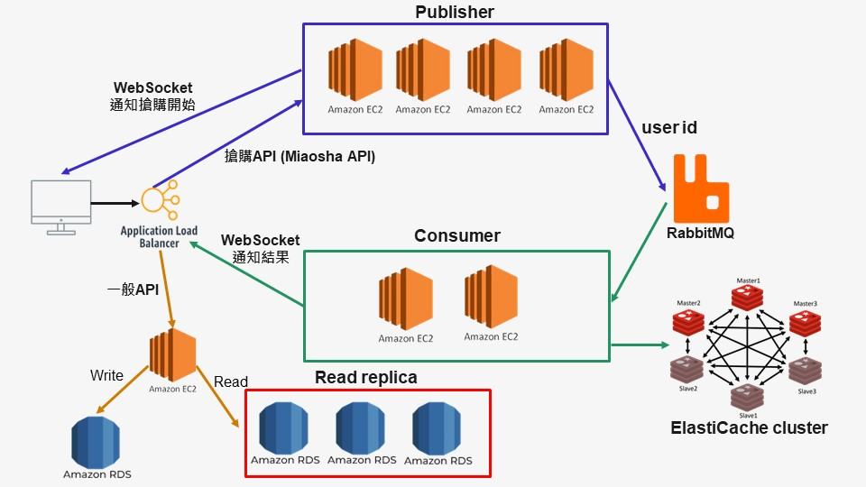
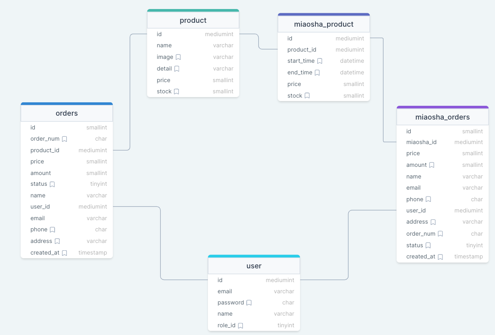
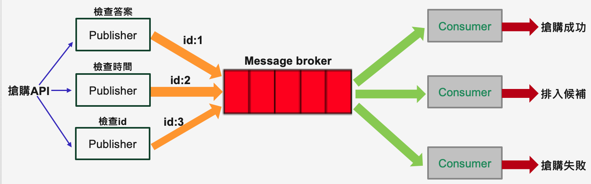
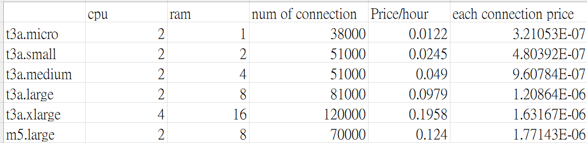

# Miaosha
Miaosha is a product-selling website which can handle the traffic from a million of users. My backend system can reach 20,000 QPS with 8 t3.nano instances and maintain 300,000 WebSocket connections with 6 t3a.small instances.

- Website Link: https://miaosha.click/
- Explanation Video: https://drive.google.com/file/d/1Y3m75dhT6n5ikO_NZSxNYeaZeiIZEPPO/view?usp=sharing

## Login

- email: nghdavid123@gmail.com
- password: test1234

## Table of Contents

- [Main Features](#main-features)
- [Backend Technique](#backend-technique)
- [System design](#system-design)
- [Architecture](#architecture)
- [Database Schema](#database-schema)
- [How to prevent overselling](#how-to-prevent-overselling)
- [Send email asynchronously](#send-email-asynchronously)
- [How to prevent robot attack](#how-to-prevent-robot-attack)
- [Asynchronously process requests](#asynchronously-process-requests)
- [How to ensure the stability of other API](#queuing-system)
- [Queuing System](#queuing-system)
- [Turn on EC2 instances and ElastiCache](#continuous-deployment)
- [Continuous Deployment](#continuous-deployment)
- [Load Test](#load-test)
- [How to start my project](#how-to-start-my-project)
- [Future Features](#future-features)

## Main Features

- Actively informed users with WebSocket instead of short polling to decrease API requests
- Improved API efficiency by processing asynchronously with RabbitMQ
- Achieved high concurrency with distributed system including Publisher, Consumer, MySQL read replica, and Redis cluster
- Routed high traffic API and general API to different EC2 target groups with Elastic Load Balancer to ensure the stability of other API
- Prevent overselling with atomic operation in Redis and short-TTL JWT
- Sent emails asynchronously with SQS and Lambda
- Complete queuing system with RabbitMQ (Dead letter exchange)
- Used EventBridge to schedule Lambda to start EC2 before each event
- Prevented malicious attacks using Nginx’s rate limiter
- Applied CloudFront as CDN to reduce bandwidth loading and latency
- Packaged Miaosha system in Docker Compose as development environment, including Node.js, MySQL, Redis cluster, RabbitMQ, and phpMyAdmin
- Continuously deployed with GitHub Actions and Docker Hub
- Performed unit test and integration test by Jest and Supertest

## Backend Technique

### Environment

- Node.js/Express
- WebSocket (Socket.IO)
- PM2

### Server
- EC2
- Elastic Load Balancer
- Auto Scaling

### Web server
- Nginx

### Serverless
- Lambda
- EventBridge

### Database

- RDS (MySQL) with read replica
- phpMyAdmin

### Cache
- ElastiCache (Redis cluster)

### Message Broker
- RabbitMQ

### Container
- Docker
- Docker Compose

### Continuous delivery
- GitHub Action
- Docker Hub

### CDN
- CloudFront

### Others
- S3
- Route53
- JWT

### Test
- Unit test: Jest, Supertest

## System design
My system design's principle is to filter the traffic layer by layer. The filter consists of six layers.
- CDN:
  * Deploy static files (html, css, js) to CloudFront
  * Ask users to answer a question
- Load Balancer:
  * Route different APIs to different target groups and multiple instances
- Web server:
  * Prevent malicious attack by nginx's rate limiter
- Application server:
  * Use WebSocket instead of short polling to decrease API requests
  * Process asynchronously to speed up process time
- Redis:
  * Store stock in cache to decrease read and write latency
  * Use cache to decrease DB loading


## Architecture
- There are three kinds of target groups (instances)
  * Publisher: Responsible for Miaosha API and Notify users the start of selling event with Socket.IO
  * Consumer: Check whether users successfully get the chance to buy and inform users of results.
  * General: Process login, checkout, etc., API
- Publisher, consumer, mysql read replica, redis cluster are horizontally scalable
- Application load balancer can route different APIs to different target groups



## Database Schema


## How to prevent overselling
Tools: Redis, JWT token

- Use atomic operation in redis to prevent race condition
- When an user got the chance to buy, the backend system would give the successful user JWT token with short expire time. The user need to submit their JWT token for verification when he checkout. If the user doesn't checkout in 10-minute time limit, the user cannot checkout successfully because JWT token is expired. Therefore, this stock is released and cannot be bought by the user.

## Send email asynchronously
- When an user successfully checks out, checkout API 
would submit email and user id to SQS before responding to an user. After that, SQS would trigger Lambda to send email with Nodemailer.


## How to prevent robot attack
- The user has to answer a question related to the product correctly
- Setup rate limiter in Nginx to prevent malicious attacks


## Asynchronously process requests
- Only check user's answer and time in publisher target group
- Send user id to RabbitMQ
- Consumer target group would check whether the user gets the chance to buy the product


## How to ensure the stability of other API (login, checkout) when selling event starts?
- When flash sale happens, a huge influx would flow into the backend system and may influence other APIs. However, elastic load balancer would route different APIs to different target groups. Miaosha API would be routed to publisher target group. Thus, consumer and general target group would not be influenced by miaosha API.

## Queuing System
- Release stocks when users forget to pay in 10-minute time limit
- Actively inform standby users of successful results via **Socket.IO**
- Store list of standby users in **Redis** List

### How do I implement the queuing system?

Tool: Redis List and RabbitMQ

1. If consumer determined the user as successful, consumer would send the user id to waiting queue with dead letter exchange.
2. If consumer determined the user as standby, consumer would send the user id to redis list.
3. After 10 mins time limit, waiting queue would send the user id to payment consumer.
4. Payment consumer would check whether the user has paid or not.
5. If the user doesn't pay, the stock would be released and be given to standby user.


## Turn on EC2 instances and ElastiCache before each selling event starts
- Use CloudWatch EventBridge to schedule Lambda to turn on and off general instances
- Use Schedule Action in auto scaling group to scale out instances


## Continuous Deployment
- Implement continuous deployment by GitHub Actions, Docker Hub and Docker Compose to automatically update app versions in general instances


## Load Test
Miaosha website must be capable of handling high traffic.
I implemented a load test to check the max WebSocket connections and miaosha API QPS. 

- Number of WebSocket connections
  * Horizontal Scaling
  * Vertical Scaling
- Miaosha API QPS
  * Horizontal Scaling
  * Vertical Scaling


Code: https://github.com/nghdavid/miaosha/tree/main/load-test

### Number of WebSocket connections
- Number of WebSocket connections
  * Vertical Scaling
    + Num of connection is correlated with 



### Miaosha API QPS

## How to start my project
```
cd dockerfiles
sudo chmod u+x start.sh
sudo chmod u+x stop.sh
cp .env_docker_template .env
ipconfig getifaddr en0 # Get your ip
# Modify .env (ip, YEAR, MONTH, DATE, HOUR, MINUTE, SECOND)
./start.sh
# Go to http://localhost:5000/main.html
# Stop docker
./stop.sh
```
## Future Features
- If there are already too many users send id to miaosha API, my backend system can change elastic load balancer's response. Elastic load balancer can directly return 'The activity is over' instead of routing requests to publisher target group.